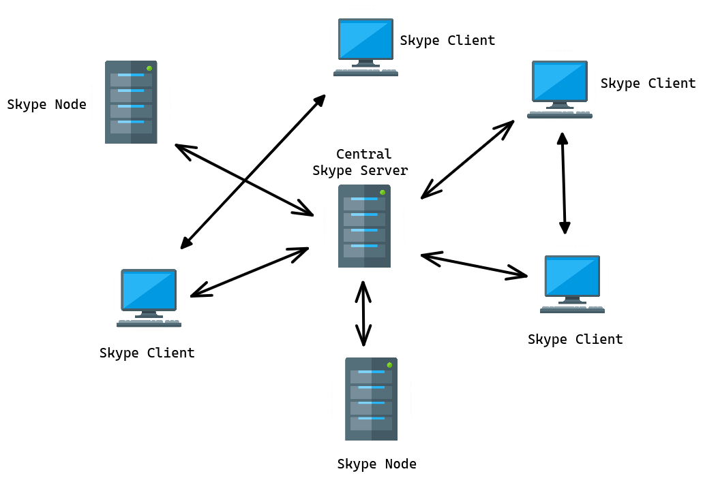
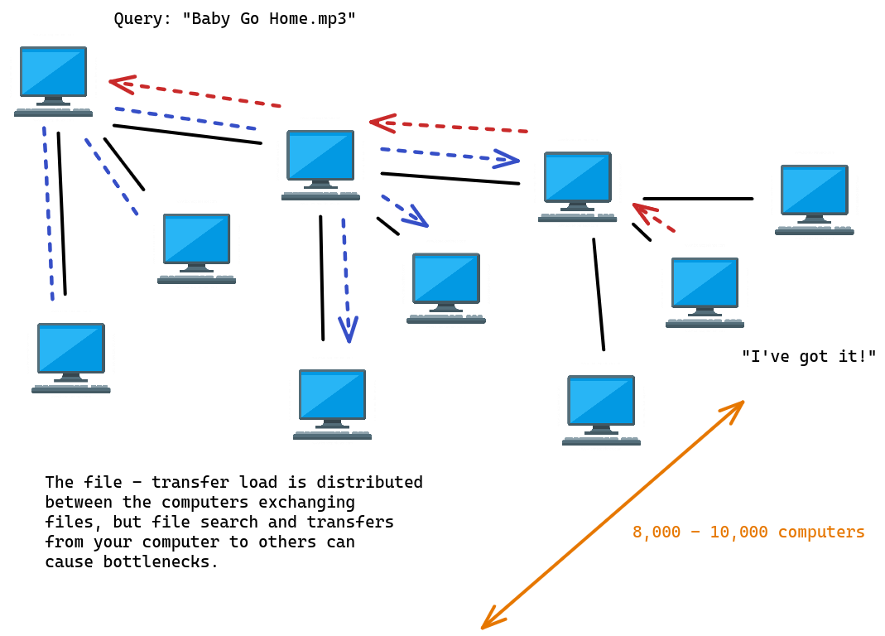
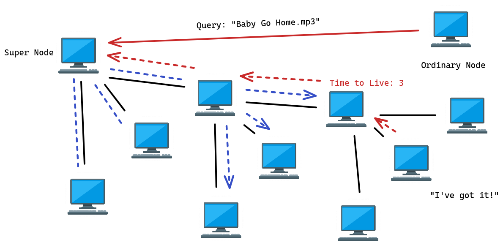
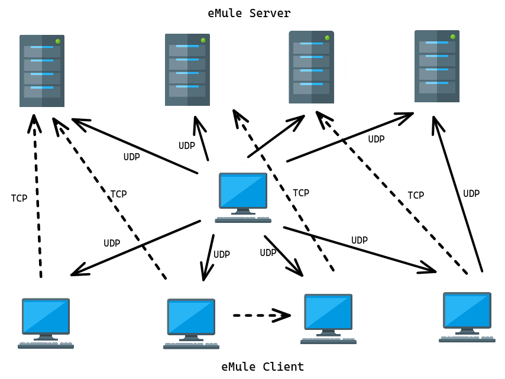
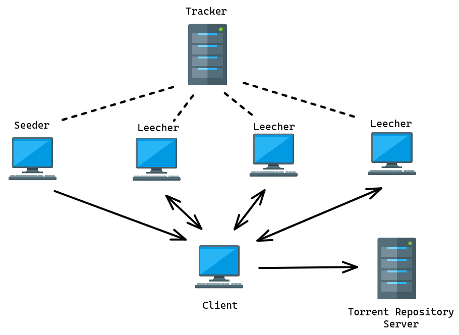
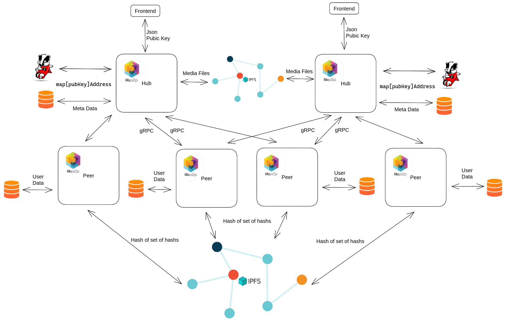
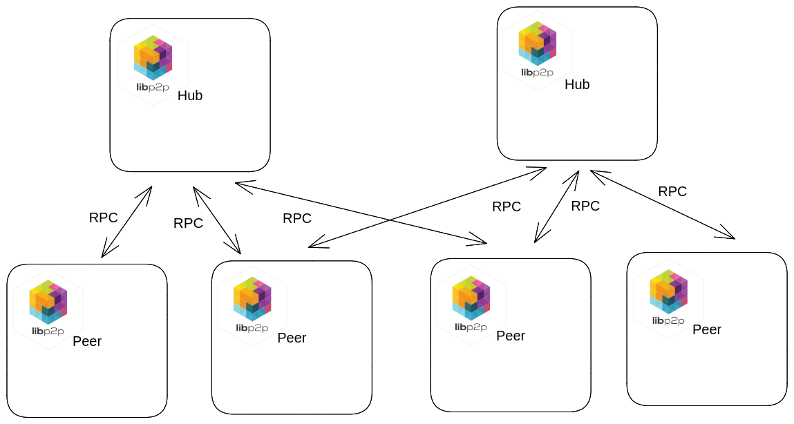

## 0.1 Abstract

Social media, which is used by most individuals, has become an integral part of modern lifestyle. However, these social networks use centralized servers to store user data, which is an approach shown to have many disadvantages such as <b> ADD A ONE OR TWO DISADVANTAGES </b>.

This proposal presents a decentralized social network that utilizes the user's device as storage, while ensuring that data remains secure and authentic, with complete control over user data residing with the user. Furthermore, the implementation of a user data decentralization protocol, along with the design and deployment of a client application capable of seamless communication with other network peers via the decentralized protocol, form the central components of the proposed solution.

<b>Key words: </b> ADD KEYWORDS HERE

## 1.0 INTRODUCTION

<!-- Common intro -->

At present, social media platforms have become integral components in the lifestyles of a vast majority of individuals. Social networks have established a global presence, with the initial recognizable social network, "Six Degrees," being launched in 1997, enabling users to establish profiles and connect with other users. Today, there are numerous social networks, such as Facebook, WhatsApp, Instagram, Twitter, and their usage continues to grow [1]. These social networks are becoming popular among people due to their purpose and differences which made them compete with each other.
It is imperative to examine the reasons for the increased usage of social networks. The most prevalent reason is that users desire to stay connected with others and remain updated on global events. With hectic schedules and workloads, physical interaction with others is often impractical, leading people to connect virtually, which proves more feasible. Additionally, social media is used for sharing photos and videos for entertainment and expressing opinions and ideas. Moreover, social media platforms serve as a means of researching products to purchase, prompting businesses to concentrate on online marketing and target audience acquisition. However, centralization of these social networks has led to various problems, which have recently become hot topics.

According to [2], MIT Sloan professor Sinan Aral said “Social media is rewiring the central nervous system of humanity in real time” at the Social Media Summit @ MIT which brought professionals together to explore these challenges and focus on solutions, which ranged from new oversight committees to breaking up major corporations. Also, it mentions major concerns in present social media networks. The spread of false news and misinformation, the difficult balance between user privacy and platform transparency and a lack of regulation for social media companies are some of the areas that have been affected through social media at present.

With the emergence of web 3.0 in 2014[3], people are inclined towards seeking solutions to the issues associated with web 2.0 technologies within the web 3.0 technology stack. As a result, decentralization has become a prominent factor. Decentralized culture has been established, primarily due to the evolution of cryptocurrencies, particularly Bitcoin.

As mentioned in [4], the growth trajectory of Web 3.0 is expected to persist, as individuals progressively recognize the advantages it offers in contrast to conventional social media websites. While searching for the most suitable web3 social media platforms, it is advisable to consider a range of factors such as traditional social media platforms, social media users, decentralized social networks, internet freedom, free speech, online networks, among other relevant considerations.

According to [5,] Mastodon [6] and DeSo [7] are two of the most prominent decentralized social networking platforms currently under development. The fundamental goal of these social networks is to confront and overcome the issues connected with modern social media platforms by yielding the monopolistic control exerted by leading social media corporations and instead conceding power to the platform's actual users.
Despite the proliferation of decentralized social media platforms presently, certain limitations and challenges still require attention. A majority of these platforms employ blockchain technology to achieve decentralization, which, as highlighted in [8], can result in higher costs in terms of processing speed.

The main objective of this research endeavor is to construct a decentralized social network that utilizes the user's device as storage, while ensuring that data remains secure and authentic, with full control over user data residing with the user. The implementation of a user data decentralization protocol, along with the design and deployment of a client application capable of seamless communication with other network peers via the decentralized protocol, form the central components of this research project.

<!-- Common intro -->
## 1.1. Background

The traditional approach to software development is to develop a software application and deploy it on a single machine. This approach is not suitable for modern applications, which are distributed in nature and are deployed on multiple machines. These applications are called distributed applications and are very complex in nature making them very difficult to develop and maintain. The are many challenges faced in developing and maintaining distributed applications are related to communication between two applications, data consistency, data availability, data security, to name a few <b> Maybe add references or reasons as to why these are problems </b>.

Communication between two applications is the basis of any distributed application. Distributed applications have mainly two types of architecture. One is client-server architecture and the other is peer-to-peer architecture <b> A reference would be good </b>. In a client-server architecture, one application is the client and the other is the server. The client application sends a request to the server and the server application responds to the client. In peer-to-peer architecture, both the applications are peers. A peer can communicate with other peers directly and each peer has the same functionality as any other peer in the network. There is no central authority in peer-to-peer architecture.

Modern client-server architecture is based on RESTful web services <b>Reference</b>. RESTful web services are based on HTTP protocol, which is stateless, meaning that the server does not remember the previous request and that it is the responsibility of the client to maintain the state of the request. Other than HTTP protocol, there are other protocols like gRPC <b>Reference to what is grpc</b> and SOAP <b>Reference to what is soap</b> which are used for communication between two applications.

In peer-to-peer architecture, there are a few protocols that are used for communication between two applications such as the torrent protocol <b>Reference</b>.
Most of them are specialized for a particular purpose and are therefore not used in general-purpose applications. Moreover, these protocols are very old and not maintained <b>Reference</b>.

The research component outlined in this proposal mainly focuses on developing a new reusable protocol for communication between two peer-to-peer applications which is based on the TCP/IP protocol.

<!-- ## 1.1.	Background and Literature -->
## 1.2. Literature Survey

This area has seen several successful projects in the past, which include the following projects.

- Skype
- Gnutella 
- Kazaa
- eMule 
- Torrent 

However, most of the projects have several problems hindering their usability which will be described in the following sections.

### 1.2.1.	Skype

[9] [Link](https://eprints.um.edu.my/4797/) Skype is a proprietary peer-to-peer Internet telephony service that allows users to communicate with others via the Internet using voice calls, video calls, and instant messaging. It uses a centralized server which helps the system sign up new users as well as authenticating existing users with user ID and password information. The super node is a peer with higher bandwidth and CPU power and is used to improve scalability. The super nodes do the heavy lifting for the Skype service, and it is considered a disadvantage as the service relies on these super nodes, not a centralized server.

According to <del>Wikipedia</del> <b>Reference the official source or the one which wikipedia also references to</b> [10] [Link](https://en.wikipedia.org/wiki/Skype):

- Initial release : August 29, 2003
- Latest release : 20 January 2023
- License : Proprietary

### 1.2.2.	Gnutella

[11] [Link](https://www.researchgate.net/publication/242320308_Deliverable_D61_ARGUGRID_Platform_Design) Gnutella is a peer-to-peer file-sharing network using the TCP/IP stack for communication. Nodes on the network can be either clients or servers and four types of messages are used in the Gnutella protocol. Ping, Pong, Query, and Query Hit.

Flooding is used to propagate messages with each message has a Time To Live (TTL) field. When TTL reaches zero, the message is dropped. A drawback of flooding is that it floods the network with a large number of messages, this does not scale well.

According to the last stable specification [12] [Link](https://courses.cs.washington.edu/courses/cse522/05au/gnutella_protocol_0.4.pdf), the last update was on 2001.

### 1.2.3.	Kazaa

[11] [Link](https://www.researchgate.net/publication/242320308_Deliverable_D61_ARGUGRID_Platform_Design) Kazaa is a peer-to-peer file-sharing application for music, video, and other digital media files. FastTrack is the underlying protocol of Kazaa and also uses the super node concept.

Kazaa has the same problem as Skype, where it relies on a super node.

According to <del>Wikipedia</del> <b>Reference the official source or the one which wikipedia also references to</b> [13] [Link](https://en.wikipedia.org/wiki/Kazaa):

- Initial release : March 1, 2001
- Latest release : 3.2.7 / 26 November 2006
- License : Proprietary

### 1.2.4.	eMule

[14] [Link](http://pages.di.unipi.it/ricci/e-mule-report.pdf) eMule is a peer-to-peer file-sharing application based on the eDonkey2000 network. eMule uses a hybrid network architecture, with a centralized server for indexing and a decentralized network for file sharing.

### 1.2.5.	Torrent

[15] [Link](https://stuker.com/wp-content/uploads/import/i-1fd3ae7c5502dfddfe8b2c7acdefaa5e-bittorrentecon.pdf)
BitTorrent is a peer-to-peer file-sharing protocol. It is used to distribute data and electronic files over the Internet. It is one of the most common protocols for transferring large files, such as digital video files containing TV shows or video clips or digital audio files containing songs.
When a user downloads a file using the BitTorrent protocol, the user becomes a seeder after the download is complete. The user can then upload the file to other users, thus becoming a leecher. With that, a file can have multiple seeders and leechers at the same time.

However, the BitTorrent protocol is specifically designed for file sharing therefore it is not suitable for general-purpose communication.

<!-- In section 1.2  -->

In summary the problems discussed in existing projects can be condensed into the following set of issues.

- Lack of good documentation or none at all.
- Restrictive licensing or no license to be found.
- Old with the last update more than a decade away.
- No easy to reach point of contact.
- Closed source (product) or the source doesn't exist anymore.
- No specification.
- Implementation does not expose a friendly API.
- Tightly coupled with a specific use.

## 1.3.	Research Gap

The main goal of this research component is to develop a new reusable peer-to-peer communication protocol that is suitable for general-purpose communication.

Most of the existing peer-to-peer protocols are designed for specific purposes, such as file sharing, and they are not suitable for general-purpose communication.

Skype is proprietary [10] [Link](https://en.wikipedia.org/wiki/Skype) and it relies on a super node [1] [Link](https://eprints.um.edu.my/4797/). Therefore, it is not suitable for general-purpose communication and the super node makes it centralized.

Gnutella has open specification [12] [Link](https://courses.cs.washington.edu/courses/cse522/05au/gnutella_protocol_0.4.pdf), and it has problems such as flooding [11] [Link](https://www.researchgate.net/publication/242320308_Deliverable_D61_ARGUGRID_Platform_Design) and TTL and it no longer maintained.

Like Gnutella, Torrent is also open source, but it is specifically designed for file sharing and it is not suitable for general purpose communication.

Kazaa [13] [Link](https://en.wikipedia.org/wiki/Kazaa) and eMule [16] [Link](https://en.wikipedia.org/wiki/EMule) are not no longer maintained.

Even though much research has been done and applications have been developed, non of them are suitable for general-purpose communication.
Developing a reusable, open-source, decentralized, peer-to-peer communication protocol is the main goal of this research component.

|   -   | Skype | Gnutella | Kazaa | eMule | Torrent |
|-------|-------|----------|-------|-------|---------|
| Live | Yes   | No       | No    | No    | Yes      |
| Open source | No | Yes | No | Yes | Yes |
| Documented | No | Yes | No | No | Yes |
| Scalable | No | No | No | No | Yes |
| General purpose | No | No | No | No | No |

## 2.0	Research Problems

After decades of protocol development, the Internet is still plagued by a number of fundamental problems. Most protocols are designed for client-server architecture, and they are not suitable for peer-to-peer architecture. peer-to-peer applications are facing scalability issues as well. There are few methods to scale peer-to-peer applications but they had their own drawbacks. Most of the existing peer-to-peer protocols are designed for specific purposes, such as file sharing, and they are not suitable for general-purpose communication. Some of them are not open source and most of them are not maintained anymore.

In this research identified the following problems of the existing peer-to-peer protocols:

- What is the best way to communicate in peer to peer network
- How to scale peer to peer communication network
- How to implement general purpose peer to peer protocol

## 3.0 Objectives

### 3.1 Main Objective

This research aims to provide a development of a new decentralized
social media protocol which keeps user date on user’s device while
providing a smooth user experience. This component aims to develop a
new reusable peer-to-peer communication protocol that is suitable for
general purpose communication. That will be helpful for the
communication between the users device and the social media platform.

### 3.2 Specific Objectives

- Design RPC-style full duplex communication protocol

    In RPC, developers can define their own data structures and functions and then use RPC to call the functions remotely.
    RPC used a binary format to exchange data. RPC is a full duplex communication protocol, which means that both the client and the server can send and receive messages at the same time.

- Use key-value store to keep track of peers

    Key-value store is a data structure that maps keys to values. It is used to maintain a list of peers. It is used to keep track of peers and their IP addresses. When a peer joins the network, it is added to the key-value store. When a peer leaves the network, it is removed from the key-value store.

- Utilizing third-party storage providers for file sharing

    Sharing files via RPC call is not efficient. Therefore, third-party storage providers are used to share files. Integrating third-party storage providers with the new peer-to-peer communication protocol will make it more efficient. The Third-party storage providers can be used to share files, images, videos, and other types of data. In this way, the peer-to-peer communication protocol and file sharing will be separated.

- Implement protocol with flexibility for any kind peer to peer communication

    Developers should be able to change the protocol as they want and 
    build their own applications on top of the protocol. The protocol should be flexible enough to be used for any kind of peer-to-peer communication.

## 4.0 Methodology

### 4.1.	Requirement Gathering

The first step of this research is to gather the requirements of the new peer-to-peer communication protocol. The requirements are gathered from the existing peer-to-peer applications and the existing peer-to-peer protocols.

### 4.2.	Past Research Analysis

The second step of this research is to analyze the past research on the existing peer-to-peer protocols. The analysis is done to identify the problems of the existing peer-to-peer protocols.

## 4.3.	Commercialization

DeMedia is focused on developing an open-source protocol that facilitates the creation of decentralized social media platforms which can be self-hosted. The project aims to provide a base model for free, which can be used by anyone interested in creating a decentralized social media platform.

In addition to the free model, DeMedia will also offer two paid models - a subscription- based membership model and an advertising-based revenue model. These paid models can be governed by the host, allowing them to generate revenue from their platform. Therefore, one could describe DeMedia as a research project focused on commercializing the development of decentralized social media platforms. The project is developing a range of monetization models that can be used by hosts to generate revenue from their platforms, thereby enabling commercialization of the technology.

To further elaborate on the commercialization aspect of DeMedia, it's important to understand that the project is focused on creating a technology that can enable the development of decentralized social media platforms. By providing a free base model, DeMedia is making it easier for individuals or organizations to create their own social media platforms that are not controlled by a centralized authority. However, to sustain and grow these platforms, there needs to be a way to generate revenue. This is where the two paid models offered by DeMedia come in. The subscription-based membership model allows hosts to charge users for access to premium features or content on their platform. This revenue can be used to cover the costs of hosting and maintaining the platform.

On the other hand, the advertising-based revenue model enables hosts to generate revenue by displaying ads on their platform. Hosts can charge advertisers to display their ads on the platform, and this revenue can be used to cover the costs of hosting and maintaining the platform, as well as generating profits.

As a summery about this proposed system, DeMedia is enabling the commercialization of decentralized social media platforms by providing a technology that allows anyone to create their own platform, along with monetization models that enable hosts to generate revenue and sustain their platforms. This could lead to a more diverse and decentralized social media ecosystem, with a greater range of platforms catering to specific sectors and communities.

## 5.0 Software Specifications, Research Review or Design Components

The high level design of decentralized social media protocol is shown in the following figure.

### 5.1.	High level design of decentralized social media protocol

### 5.2.	High level design of component

### 5.3. Proposed Technology Stack

Frontend development

    - Vue
    - Quasar
    - Mitt
    - Markdown

Libraries

    - libp2p
    - bootstrap-vue
    - lodash
    - tailwindcss

Data Storage

    - IPFS
    - PostgreSQL
    - BadgerDB

Hosting

    - AWS

## 6.0. Project Requirements

Functional Requirements
- Discover other peers on the network and establish connections with them
- Should be able to transfer binary objects from one peer to another peer
- Flexible API for integration with any peer to peer application 

Non functional Requirements
- Performance
- Fault tolerance
- Scalability
- Availability
- Usability
- Better developer experience

## 7.0 Conclusion

The main goal of this research component is to develop a new reusable peer-to-peer communication protocol that is suitable for general-purpose communication. Most of the existing peer-to-peer protocols are designed for specific purposes, such as file sharing, and they are not suitable for general-purpose communication. Skype is proprietary and it relies on a super node. Gnutella has open specifications, and it has problems such as flooding and TTL and it is no longer maintained. Like Gnutella, Torrent is also open source, but it is specifically designed for file sharing and it is not suitable for general-purpose communication. Kazaa and eMule are not no longer maintained. Even though much research has been done and applications have been developed, non of them are suitable for general-purpose communication. Developing a reusable, open-source, decentralized, peer-to-peer communication protocol is the main goal of this research component.

## 8.0 References

[1]. B. in Marketing, “The evolution of social media: How did it begin and where could it go next?,” Maryville Online, 03-Mar-2021. [Online]. Available: https://online.maryville.edu/blog/evolution-social-media/. [Accessed: 20-Mar-2023].

[2]. S. Brown, “Social media is broken. A new report offers 25 ways to fix it,” MIT Sloan, 30-Jun-2021. [Online]. Available: https://mitsloan.mit.edu/ideas-made-to- matter/social-media-broken-a-new-report-offers-25-ways-to-fix-it. [Accessed: 20- Mar-2023].

[3]. Sketchar, “What advantages does web 3.0 give to creators?,” Sketchar, 03-Mar- 2023. [Online]. Available: https://blog.sketchar.io/what-advantages-does-web-3-0- give-to-creators/. [Accessed: 20-Mar-2023].

[4]. “Web3 social media platforms in 2023: Why they are the future,” GamesPad, 14- Mar-2023. [Online]. Available: https://gamespad.io/web3-social-media-platforms-in- 2023-why-they-are-the-future/. [Accessed: 20-Mar-2023].

[5]. “Top decentralized social networks startups,” Tracxn. [Online]. Available: https://tracxn.com/d/trending-themes/Startups-in-Decentralized-Social-Networks. [Accessed: 20-Mar-2023].

[6]. “Decentralized social media,” Mastodon. [Online]. Available: https://joinmastodon.org/. [Accessed: 20-Mar-2023].

[7]. S. Freight, “The decentralized social blockchain,” DeSo. [Online]. Available: https://www.deso.com/. [Accessed: 20-Mar-2023].

[8]. R. Nourmohammadi and K. Zhang, "An On-Chain Governance Model Based on Particle Swarm Optimization for Reducing Blockchain Forks," in IEEE Access, vol. 10, pp. 118965-118980, 2022, doi: 10.1109/ACCESS.2022.3221419.

---

[9] 	Y. A.-N. R. M. N. Mehdi Jahanirad*, "Security measures for VoIP application: A state of the art review," Academic Journals, 2011.

[10] 	"Skype," [Online]. Available: https://en.wikipedia.org/wiki/Skype.

[11] 	S. K. M. G. Leonidas Lymberopoulos, "Deliverable D.6.1: ARGUGRID Platform Design," 2007.

[12] 	"GnutellaProtocol0," [Online]. Available: https://courses.cs.washington.edu/courses/cse522/05au/gnutella_protocol_0.4.pdf.

[13] 	"Kazaa," [Online]. Available: https://en.wikipedia.org/wiki/Kazaa.

[14] 	D. B. Yoram Kulbak, "The eMule/eDonkey protocol," 2005 17 January. [Online]. Available: http://pages.di.unipi.it/ricci/e-mule-report.pdf.

[15] 	B. Cohen, 22 May 2003. [Online]. Available: https://stuker.com/wp-content/uploads/import/i-1fd3ae7c5502dfddfe8b2c7acdefaa5e-bittorrentecon.pdf.

[16] 	"eMule," [Online]. Available: https://en.wikipedia.org/wiki/EMule.
